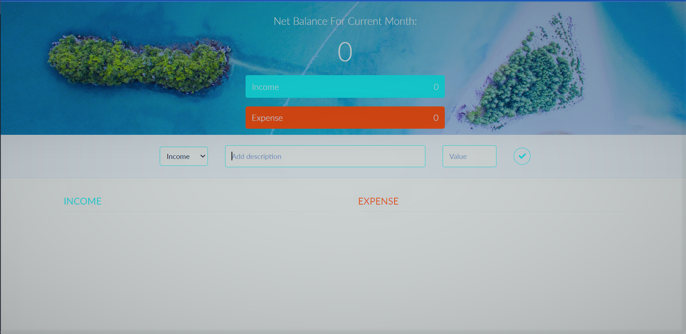

<div align="center">
	<h1> Budgety - Calculate Effectively The Net Balance of Total Income and Expenses</h1>
</div>

## Snapshots 📸



## Tech Stack ✨

- [React.js](https://reactjs.org/) - UI Library
- [Create React App](https://create-react-app.dev/) - Build tool
- [Netlify](https://www.netlify.com/) - Hosting and Deployment

## How to run locally 💻

Follow these steps to run Budgety in your local machine.

### Clone this repository

```bash
git clone https://github.com/Pappyjay23/budget-app.git
```

### Navigate to directory

```bash
cd budget-app
```

### Install NPM

```bash
npm install
```

### Run

Run the development server to view the app.

```bash
npm start
```

Now, you can navigate to http://localhost:3000/ to view the app.

### Build

```bash
npm run build
```

## Credits ✍

Implementation by [@Pappyjay23](https://github.com/Pappyjay23)
